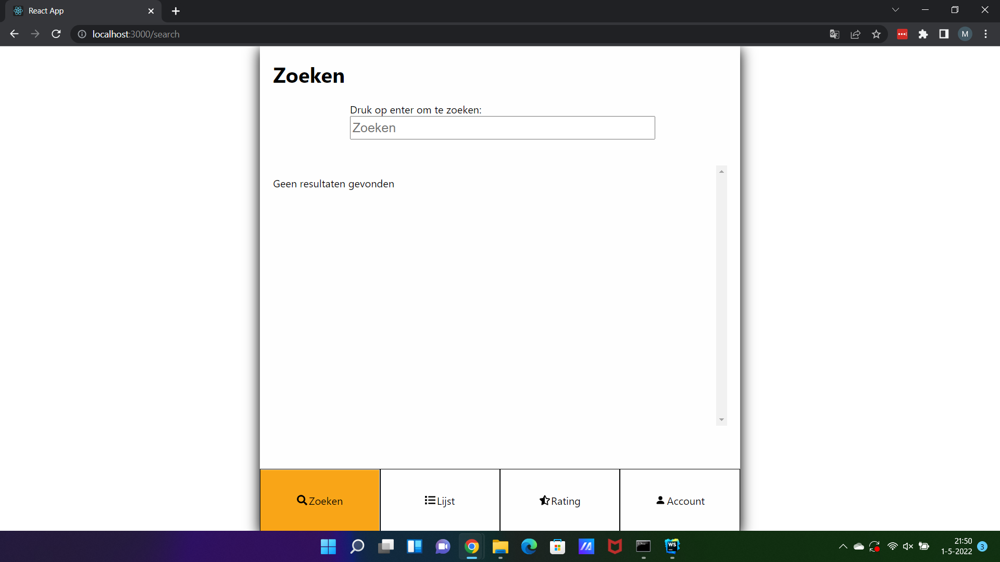
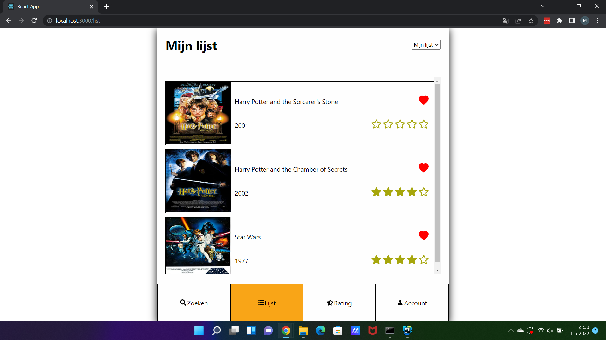
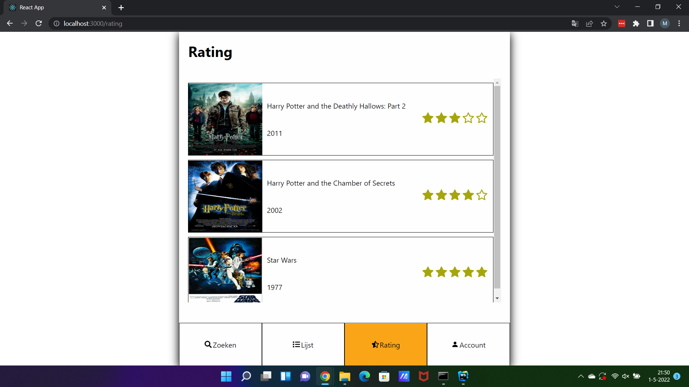
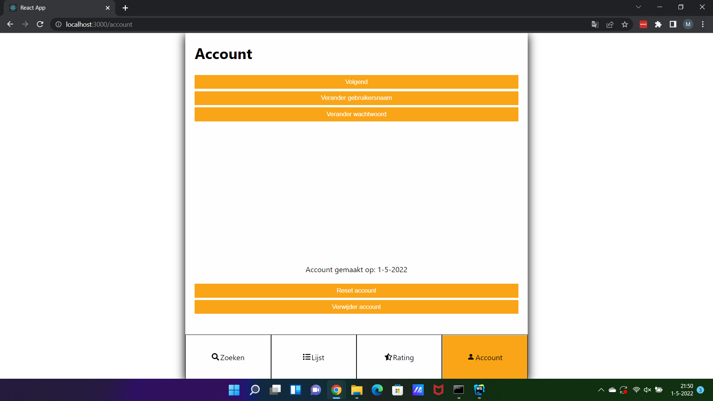

#Movie List Web App
https://github.com/MerijnMolenaar98/movie-list-fo-eindopdracht

Met de Movie List Web App kan je films opzoeken, liken/opslaan, ratings geven en informatie inzien.
Je kan ook andere gebruikers volgen en zien welke films zei leuk vinden.

# Benodigdheden:
Node.js,
Internet,
Browser

# Installatie

Ga in de terminal naar de root folder van het project.
Daar voor je uit:

### npm install

vervolgens voer je uit:

### npm start

Ga daarna in de browser naar: 

http://localhost:3000

Nu kan je een account aanmaken en inloggen!